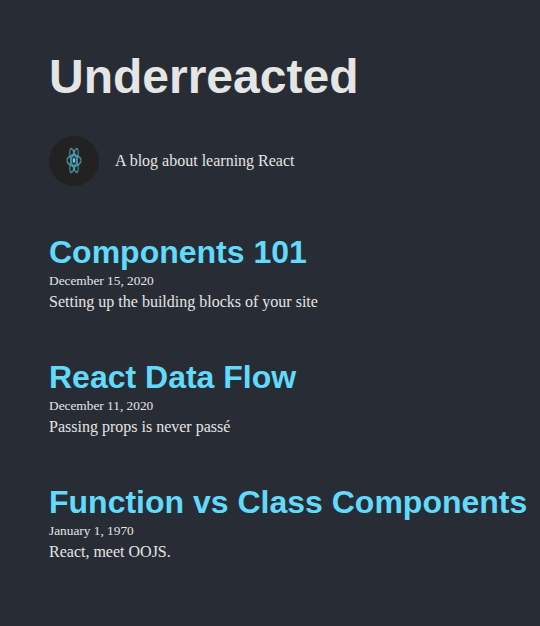

## Underreacted Blog

A simple React blog application that displays posts, along with a header and about section. Built with reusable components and designed to showcase **prop-based rendering**, **component hierarchy**, and basic React features.

## Blog Image

## Features

- **Header Component:** Displays the blog name.
- **About Component:** Displays an about section with a logo image.
- **ArticleList Component:** Displays a list of articles dynamically from a posts array.
- **Article Component:** Displays individual article details, including title, preview, and date.
- **Default Props:** Ensures placeholder image and date are shown if no data is provided.
- **Responsive Design:** Built to be simple and responsive using standard CSS (can be enhanced with Tailwind CSS or other styling libraries).

## Project Structure

├── About
│   └── About.jsx
├── App.jsx
├── ArticleList
│   ├── Article
│   │   └── Article.jsx
│   └── ArticleList.jsx
└── Header
    └── Header.jsx

## How to Install and Use

# You require

-Node.js >= 24
-npm

-clone the repository
-Navigate to the project folder
(cd react-components-props-vite-lab)
-Install dependencies (npm install)
-Run the app (npm run dev)

## Technologies Used

-React – Frontend library for building UI components.
-React Testing Library & Jest – For testing components.
-JSX – Core language.
-CSS – Structure and styling.

## Author

Patrick Mutua
